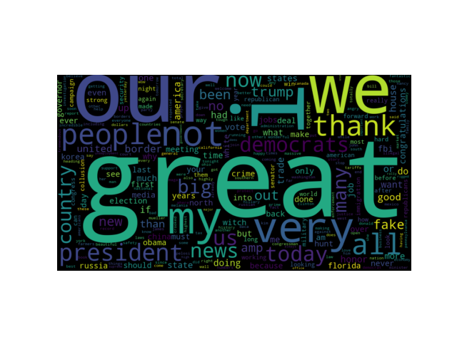

#  **Word Frequency Analysis of Trump's Most Recent Tweets**
   By Gianna Tricola and Michael Custance

 
# Twitter as a data source
 1. Public access
 2. Diverse user base
 
 
    
# Trump as a subject 
 1. Influential
 2. Controversial 
 3. Entertaining
 
 
 

 
# Word Frequency Analysis
   Useful for linguistic analyses as they:
   
   * give insight into the vernacular of individuals and groups of people in specific regions during particular periods of time.
        
   * provide information on trending topics
   
   
   
 
 
# First Steps
   1. Twitter account
   2. Submit request for Twitter developer account
   3. Access the API tokens / Consumer keys 
   4. Install Tweepy 
   
   
   
   
 

# Import Twitter Data
   1. Import necessary packages 
   2. Assign API's and Access Tokens to variables
   3. Create function to pull data from twitter 
   4. Convert data into csv file
   
     # import necessary packages
    import pip, csv, json, tweepy, fnmatch, string
    import numpy as np
    import matplotlib.pyplot as plt
    import pandas as pd
    import seaborn as sns
    from collections import Counter
    from wordcloud import WordCloud
    from PIL import Image

    ### get in twitter environment ###
    ### source activate twitter ###
    consumer_key = 'kbMAphoqE5gMUJIofDwRAA8Mm' # API Key
    consumer_secret = '8XiLrPhol1L6FVxHGXgQgNEh0ngvUx5xlQUXny0ZiI6Q0Uue7I' # API Secret
    access_key = '878766942085156865-IOJccRODzhK4JsQGHfu0s6k5geBoZMs' # Access Token
    access_secret = 'dlZbMrubLkzLTbnvq32htRoR4seZHrym4n2MxOwE0o0hx' # Access Token Secret

    ### ping a twitter account and extract tweets ###
    ### https://gist.github.com/yanofsky/5436496 but change python2 things to python3 ###
    def get_all_tweets(screen_name):

	# Twitter only allows access to a users most recent ~3240 tweets with this method

	# authorize twitter, initialize tweepy
	auth = tweepy.OAuthHandler(consumer_key, consumer_secret)
	auth.set_access_token(access_key, access_secret)
	api = tweepy.API(auth)
	
	# initialize a list to hold all the tweepy Tweets
	alltweets = []	
	
	# make initial request for most recent tweets (200 is the maximum allowed count)
	new_tweets = api.user_timeline(screen_name = screen_name,count=200)
	
	# save most recent tweets into alltweets list
	alltweets.extend(new_tweets)
	
	# save the id of the next tweet that wasn't originally pulled
	oldest = alltweets[-1].id - 1
	
	# keep grabbing tweets until there are no tweets left to grab
	while len(new_tweets) > 0:
		print("getting tweets before %s" % (oldest))
		
		# all subsequent requests use the max_id paramater to prevent duplicates and pull the next group of tweets
		new_tweets = api.user_timeline(screen_name = screen_name,count=200,max_id=oldest)
		
		# save most recent tweets into alltweets list
		alltweets.extend(new_tweets)

        # save the id of the next tweet that wasn't originally pulled
		oldest = alltweets[-1].id - 1
		
		print("...%s tweets downloaded so far" % (len(alltweets)))
	
	# transform the tweepy tweets into a 2D array that will populate the csv
	outtweets = [[tweet.text.encode("utf-8")] for tweet in alltweets]

	# return outtweets

	# write utf-8 converted tweets into a csv file
	with open('%s_tweets.csv' % screen_name, 'w') as f:
		writer = csv.writer(f)

		writer.writerows(outtweets)
	
	pass
	
	  if __name__ == '__main__':
        # pass in the username of the account you want extract the tweets from
    user_name = 'realDonaldTrump' # can input a different twitter handle here to analyze
    get_all_tweets(user_name)

    # pd.read_csv('realDonaldTrump_tweets.csv')

    # name the CSV using the twitter handle you are analyzing
    filename = "%s_tweets.csv" % (user_name)
    f2 = open(filename)
# Filter the data 
 
   1. Remove retweets
   2. Exclude numbers, twitter handles, urls, prepositions, punctuation
   
     ### split tweets into 2 lists: retweets and orig_tweets ###
    retweets = [] # can ignore this list, since we are not analyzing retweets
    orig_tweets = []
    for tweet in f2:
     # print(tweet)
    if "RT" in tweet:
        retweets.append(tweet)
        # continue # if you want to skip these tweets rather than assigning them to the list retweets
    else:
        orig_tweets.append(tweet)

    # print(orig_tweets)
    # print(retweets)
    # print(len(orig_tweets))
    # print(len(retweets))

    ### from orig_tweets, exclude words that contain numbers, @, or url's into word_list ###
    unwanted_word_list = []
    word_list = []
    for tweet in orig_tweets:
        # print(tweet)
    fields = tweet.strip("\r\n").split() # splits strings in orig_tweets into lists of strings
    # print(fields)                       # where each word is it's own string
    for word in fields:
        # print(word)
        ### exclude meaningless words, twitter handles, numbers, and URLs ###
        exclusions = ["*https://*", "*@*", "*1*", "*2*", "*3*", "*4*",
         "*5*", "*6*", "*7*", "*8*", "*9*", "*0*", "the", "a", "and", "to", "on", "is", "in", "of", "in",
          "for", "with", "that", "be", "will", "it", "as", "was", "at", "are", "this", "from"]
        if any(fnmatch.fnmatch(word, exclusion) for exclusion in exclusions):
            unwanted_word_list.append(word)
            # continue # if you want to skip these tweets
        else:
            translator = str.maketrans('', '', string.punctuation) # remove punctuation from word strings
            word = word.translate(translator)
            word_list.append(word.lower()) # make all characters lowercase so identical words don't read differently

    # print(unwanted_word_list)
    # print(word_list)
    # print(len(unwanted_word_list))
    # print(len(word_list))
    
# Processed data
 1. Generate a dictionary that gives word: frequency as a key: value pair
 2. Define threshold in the parameters 

        ### get word frequency from word_list and assign to a dictionary ###
         counts = Counter(word_list) # count word frequency and assign to a dictionary
        # print(counts)
        threshold_value = 20 # sets a threshold for the number of times a twitter user has used a word
        threshold_counts = {} # new dictionary with only words above threshold value
        for key, value in counts.items():
        if value > threshold_value:
        threshold_counts[key] = value
        # print(len(threshold_counts))
    

# WordCloud 
   1. Import wordcloud package to generate a plot
   2. Input dictionary of word:frequency values

    ### wordcloud using threshold_counts ###
    ### https://stackoverflow.com/questions/43043437/wordcloud-python-with-generate-from-frequencies?rq=1 ###
    wordcloud = WordCloud(width=900,height=500, max_words=1628,relative_scaling=1,
    normalize_plurals=True).generate_from_frequencies(threshold_counts)

    plt.imshow(wordcloud, interpolation='bilinear')
    plt.axis("off")
    plt.show()
   
   
# RESULTS!

# Next steps
 1. Clean the data
 2. Fix 'b' in front of some words (an artifact of the words being byte objects)
 

    
    
    