#  **Word Frequency Analysis of Trump's Most Recent Tweets**
   By Gianna Tricola and Michael Custance

 
# Twitter as a data source
 1. Public access
 2. Diverse user base
 
 
    
# Trump as a subject 
 1. Influential
 2. Controversial 
 3. Entertaining
 
 
 

 
# Word Frequency Analysis
   Useful for linguistic analyses as they:
   
   * give insight into the vernacular of individuals and groups of people in specific regions during particular periods of time.
        
   * provide information on trending topics
   
   
   
 
 
# First Steps
   1. Twitter account
   2. Submit request for Twitter developer account
   3. Access the API tokens / Consumer keys 
   4. Install Tweepy 
   
   
   
   
 

# Import Twitter Data
   1. Import necessary packages 
   2. Assign API's and Access Tokens to variables
   3. Create function to pull data from twitter 
   4. Convert data into a text file
   
 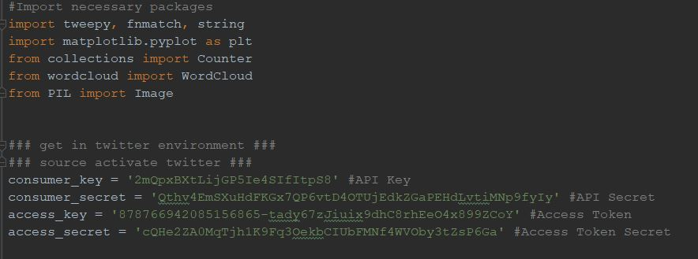
 
# Write function to pull data from Twitter
 1. Define a function that accesses the twitter data 
 2. Create a list of the first 200 tweets
 3. Create a loop that continues to pull 200 tweets, generating a list of lists
 4. Write the list of lists as a text file
 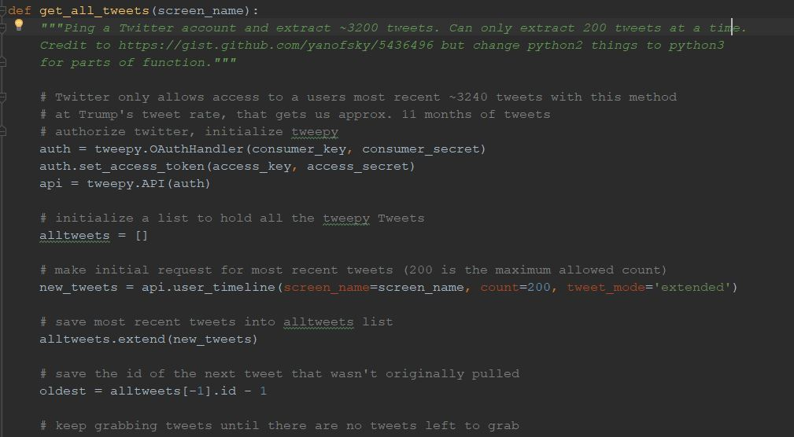
 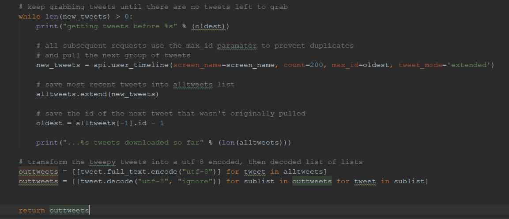
 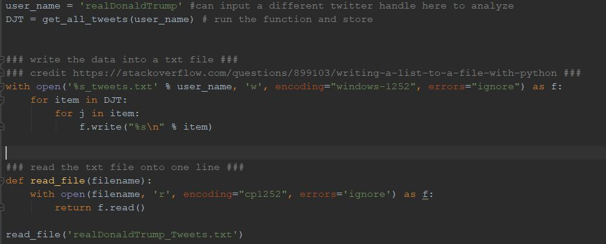
 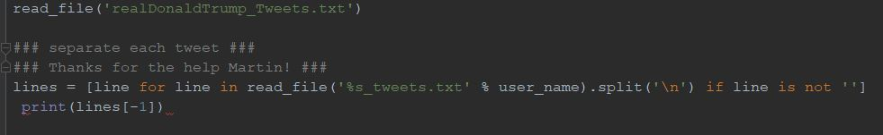
  
# Clean the data 
 
   1. Separate retweets from original tweets
   2. Exclude numbers, twitter handles, urls, prepositions, punctuation
   3. Exclude conjunctions/prepositions 
   
 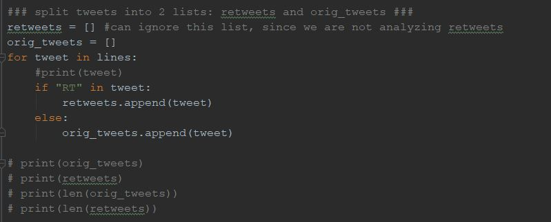
 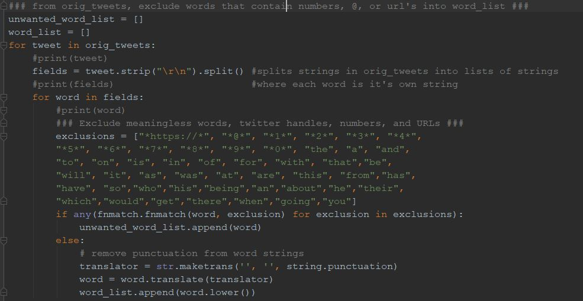
 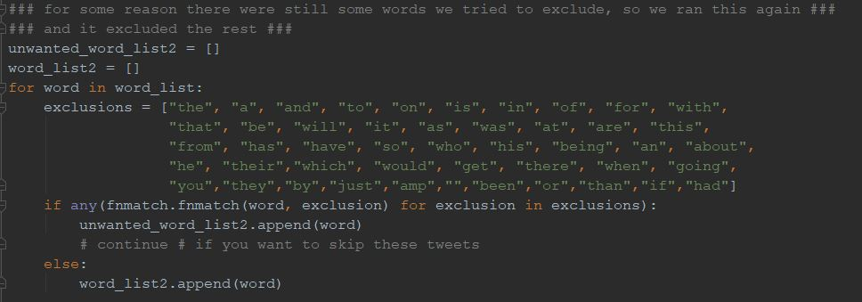
    
# Processed data
 1. Generate a dictionary that gives word: frequency as a key: value pair
 2. Define threshold in the parameters 

 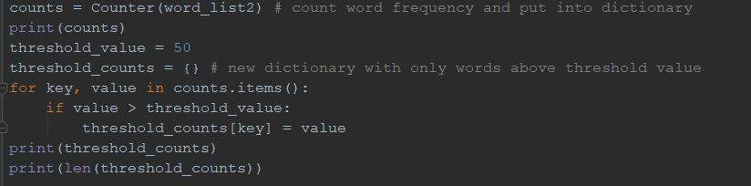
    

# WordCloud 
   1. Import wordcloud package to generate a plot
   2. Input dictionary of word:frequency values

 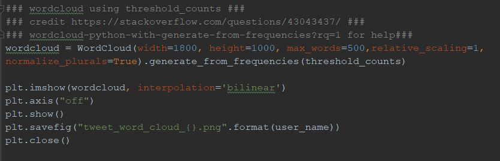
   
# RESULTS!

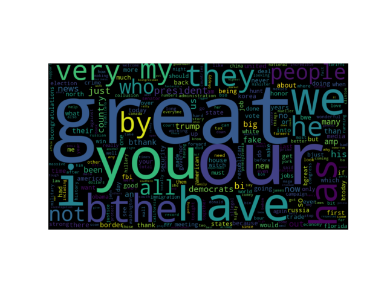

# Problems
  1. Realizing our csv file was actually a text file 
  2. Encoding with UTF-8 vs. Windows-1252
  4. Pulling 280 characters vs. 140 characters from Twitter
    

    
    
    